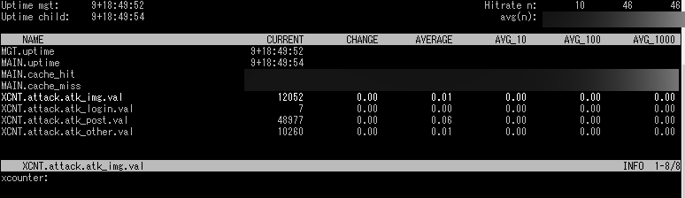

.. image:: https://github.com/xcir/libvmod-xcounter/actions/workflows/test.yml/badge.svg?branch=master
    :target: https://github.com/xcir/libvmod-xcounter/actions/workflows/test.yml

============
vmod-xcounter
============

------------------------------------
Custom Counter
------------------------------------

:Author: Shohei Tanaka(@xcir)
:Date: 2021-10-18
:Version: 70.4
:Support Varnish Version: 6.0.x 6.1.x 6.2.x 6.3.x 6.4.x 6.5.x 6.6.x 7.0.x
:Check Varnish Version: see .github/workflows/test.yml
:Manual section: 3

SYNOPSIS
========

import xcounter;

Versioning(Source)
====================
[varnish-version].[library-version]

65.1 is v1 for Varnish6.5.x

Versioning(Package)
====================
[VRT-version].[Source-version]

120.65.1 is 65.1 for VRT12.0

============ ===============
VRT Version  Varnish Version 
------------ ---------------
14.0         7.0.x
13.0         6.6.x
12.0         6.5.x
11.0         6.4.x
10.0         6.3.x
9.0          6.2.x
8.0          6.1.x
7.1          6.0.4~6.0.x
7.0          6.0.0~6.0.3
============ ===============

DESCRIPTION
===========

vmod_xcounter enables custom counter in Varnish.

``varnishstat -f XCNT.*``

For example, count to the number of requests per domain.

vcl sample:
::

  import xcounter;

  sub vcl_init {
    new example_net = xcounter.vsc();
  }

  sub vcl_recv {
    if(req.http.host == "example.net"){
      example_net.incr(1);
    }
  }

varnishstat output
::

  $ sudo varnishstat -1 -f "XCNT.*"
  XCNT.reload_20181118_042545_24957.example_net.val            1          .   xcounter

ATTENTION
=========

The counter is linked to the VCL.

Add new entry per new(reload) VCL.

INT elapsed()
--------------------

Description
      Get elapsed time.

Example
::

      if(xcounter.elapsed() > 1s){...}

vsc(...)
---------
::

      new xvsc = vsc(
         ENUM {bitmap, bytes, duration, integer} format=integer,
         ENUM {bitmap, counter, gauge} type=counter,
         ENUM {info, debug, diag} level=info,
         STRING oneliner="xcounter",
         BOOL hidecold=1,
         BOOL hidevclname=0,
         STRING groupname=""
      )

Description
          Create a counter.

          Counter name format
          ::

            XCNT.boot.group.object.val
            ("XCNT.%s.%s%s.val", vclname, groupname, objectname)

          ``format`` Counter format.

          ``type`` Counter type.

          ``level`` Counter level.

          ``oneliner`` Counter description.

          ``hidecold`` Hide counter, if state of vcl becomes cold.

          ``hidevclname`` Do not include vclname(boot,reload... etc) in counter name, if set to true.
          
          ``groupname`` Add group name.

Example
::
          new xcnt = xcounter.vsc();

VOID xvsc.incr(INT d, BOOL threadsafe=1)
--------------------

Description
          Increment vlaue.

          Negative values are ignored

Example
::

          xcnt.incr(1);

VOID xvsc.decr(INT d, BOOL threadsafe=1)
-------------------

Description
          Decrement value.

          Negative values are ignored.

Example
::

          xcnt.decr(1);

VOID xvsc.set(INT)
---------------------

Description
      Set value.

Example
::

      xcnt.set(1024);

INT xvsc.get()
--------------------

Description
      Get current value.

Example
::

      if(xcnt.get() > 1024){...}

INSTALLATION
============

Binaries for Varnish 6.0 LTS (CentOS / RedHat 7)
-------------------------------------------------

Provided by GetPageSpeed

::

    yum -y install https://extras.getpagespeed.com/release-el7-latest.rpm yum-utils
    yum-config-manager --enable getpagespeed-extras-varnish60
    yum install vmod-xcounter

More on the VMODs repository `here <https://www.getpagespeed.com/redhat>`_.

Source build
---------------------

For other platforms you would use compilation.

The source tree is based on autotools to configure the building, and
does also have the necessary bits in place to do functional unit tests
using the ``varnishtest`` tool.

Building requires the Varnish header files and uses pkg-config to find
the necessary paths.

Usage::

 ./autogen.sh
 ./configure

If you have installed Varnish to a non-standard directory, call
``autogen.sh`` and ``configure`` with ``PKG_CONFIG_PATH`` pointing to
the appropriate path. For instance, when varnishd configure was called
with ``--prefix=$PREFIX``, use

::

 export PKG_CONFIG_PATH=${PREFIX}/lib/pkgconfig
 export ACLOCAL_PATH=${PREFIX}/share/aclocal

The module will inherit its prefix from Varnish, unless you specify a
different ``--prefix`` when running the ``configure`` script for this
module.

Make targets:

* make - builds the vmod.
* make install - installs your vmod.
* make check - runs the unit tests in ``src/tests/*.vtc``.
* make distcheck - run check and prepare a tarball of the vmod.

If you build a dist tarball, you don't need any of the autotools or
pkg-config. You can build the module simply by running::

 ./configure
 make

Package build
---------------------

This function is beta.

Usage::

  ./sw_vrt.sh [VRT version]
  debuild -us -uc

Installation directories
------------------------

By default, the vmod ``configure`` script installs the built vmod in the
directory relevant to the prefix. The vmod installation directory can be
overridden by passing the ``vmoddir`` variable to ``make install``.

COMMON PROBLEMS
===============

* configure: error: Need varnish.m4 -- see README.rst

  Check whether ``PKG_CONFIG_PATH`` and ``ACLOCAL_PATH`` were set correctly
  before calling ``autogen.sh`` and ``configure``

* Incompatibilities with different Varnish Cache versions

  Make sure you build this vmod against its correspondent Varnish Cache version.
  For instance, to build against Varnish Cache 4.1, this vmod must be built from
  branch 4.1.

* Require GCC

  This vmod using GCC Atomic builtins.
